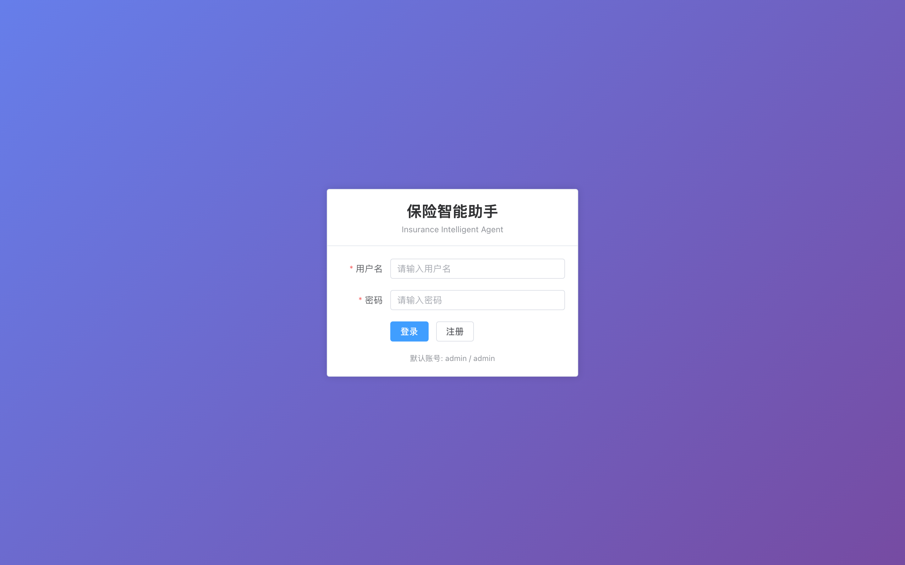
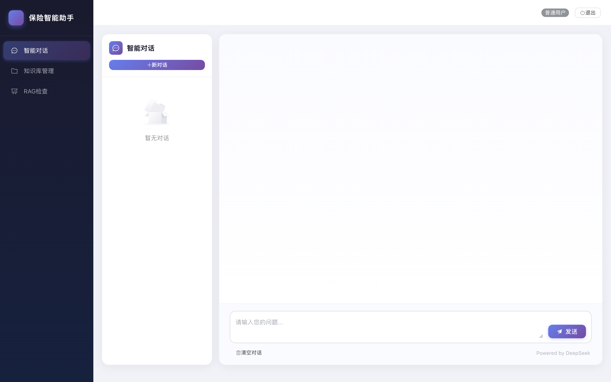
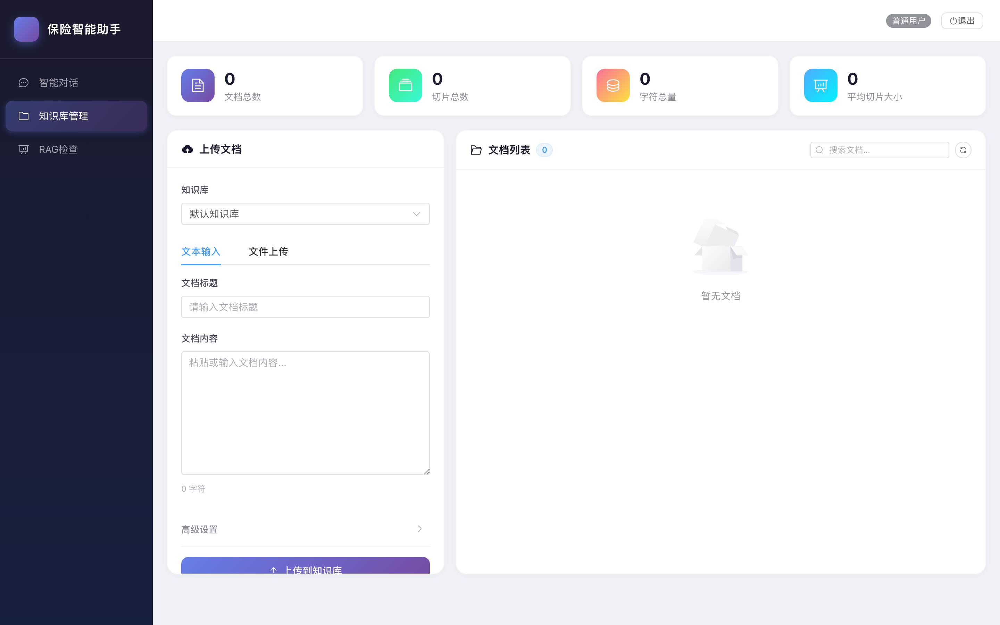
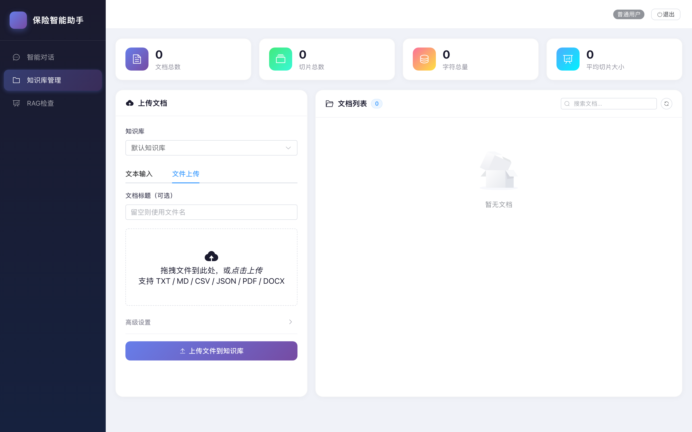
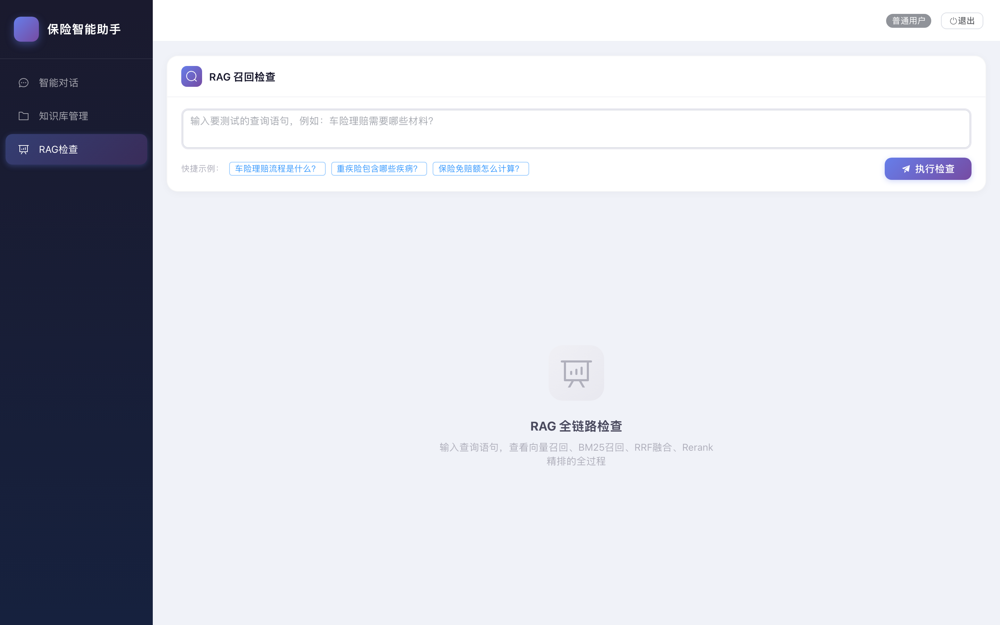

# REMIND — 保险智能助手项目备忘

> 本文档记录项目架构、技术选型、关键配置及开发约定，供 AI 助手和开发者快速上下文恢复。

## 1. 项目概述

**保险智能助手** — 基于 LangGraph 的多 Agent 保险问答系统，支持 RAG 检索、工具调用、人工审核（HITL）。

- 前端: Vue 3 + Element Plus + Vite
- 后端: FastAPI + LangGraph + LangChain
- 存储: SQLite (会话持久化) + ChromaDB (向量库)
- LLM: DeepSeek (默认) / Ollama (本地) / Qwen 千问 (DashScope) — 通过配置切换

## 2. 目录结构

```
policy_agent/
├── .env                          # 环境变量（API Key 等）
├── start.sh                      # 统一启动/停止/重启脚本
├── data/
│   ├── checkpoints.sqlite        # LangGraph 会话持久化
│   └── chroma/                   # ChromaDB 向量数据
├── docs/
│   └── screenshots/              # 前端页面截图（详见第 6 节）
├── logs/
│   ├── backend.log
│   └── frontend.log
├── scripts/
│   └── take_screenshots.py       # 使用 Playwright 自动生成页面截图
├── backend/
│   ├── main.py                   # FastAPI 入口 (lifespan 初始化 checkpointer)
│   ├── config/settings.py        # Pydantic Settings (PROJECT_ROOT = parent.parent.parent)
│   ├── api/
│   │   ├── routes.py             # 所有 API 路由 (chat/kb/rag/auth/users)
│   │   ├── schemas.py             # Pydantic 请求/响应模型
│   │   └── auth.py               # JWT 鉴权 + UserStore
│   ├── core/
│   │   ├── graph.py              # 主 Agent 图构建
│   │   ├── state.py              # AgentState TypedDict
│   │   ├── checkpointer.py       # AsyncSqliteSaver 持久化
│   │   ├── nodes/                # compress/rewrite/route/assemble/final_generate
│   │   └── subgraphs/           # rag_subgraph / tool_subgraph
│   ├── llm/
│   │   ├── router.py             # get_llm(TaskType.HEAVY/LIGHT) + 三模型可配置切换
│   │   ├── deepseek_client.py    # ChatDeepSeek (默认)
│   │   ├── qwen_client.py        # 千问 (DashScope OpenAI 兼容接口)
│   │   ├── local_qwen_client.py  # 本地 Ollama (ChatOllama, 降级)
│   │   └── embeddings.py         # OllamaEmbeddings
│   ├── retrievers/
│   │   ├── vector.py             # ChromaDB 向量检索
│   │   ├── bm25.py               # BM25 关键词检索
│   │   └── rerank.py             # Ollama bge-reranker 重排序
│   └── tools/                    # 保险业务工具 (claim/policy/high_risk)
└── frontend/
    └── src/
        ├── pages/Chat.vue        # 智能对话（流式输出 + 会话恢复）
        ├── pages/KnowledgeBase.vue # 知识库管理（文本/文件上传/删除/搜索）
        ├── pages/Inspect.vue     # RAG 检查（全链路可视化）
        ├── pages/Layout.vue      # 侧边栏布局
        ├── pages/Login.vue       # 登录页
        ├── components/HitlCard.vue # HITL 审核卡片
        └── api/                   # axios + SSE 封装
```

## 3. 启动方式

```bash
./start.sh start [mock]   # 启动 (mock = 离线测试模式)
./start.sh stop            # 停止
./start.sh restart [mock]  # 重启
./start.sh status          # 查看状态
```

- 后端: http://localhost:8000 (API 文档: /docs)
- 前端: http://localhost:5173
- 默认账号: admin / admin

## 4. 关键配置

### .env 文件

```env
# 主 LLM 提供方: deepseek | ollama | qwen   默认 deepseek
LLM_PROVIDER=deepseek
# 主 LLM 不可用时的降级顺序（逗号分隔）；为空则不降级，最终回退到 mock
LLM_FALLBACK_CHAIN=ollama,qwen

# DeepSeek
DEEPSEEK_API_KEY=sk-xxxxx

# 千问 (DashScope) — 切换到 Qwen 时必填
DASHSCOPE_API_KEY=sk-xxxxx
QWEN_MODEL=qwen-plus

# Ollama (本地)
OLLAMA_BASE_URL=http://localhost:11434
OLLAMA_MODEL=qwen3.5:0.8b

# Mock 模式 (离线测试)
POLICY_AGENT_MOCK_LLM=False
```

### LLM 路由策略

支持三种 LLM 提供方，通过 `LLM_PROVIDER` 配置项切换：

| Provider | 说明 | 必要配置 |
|----------|------|----------|
| `deepseek` (默认) | DeepSeek 官方 API，`deepseek-chat` 模型 | `DEEPSEEK_API_KEY` |
| `qwen` | 阿里千问，通过 DashScope OpenAI 兼容接口，模型可选 `qwen-plus`/`qwen-turbo`/`qwen-max`/`qwen-long` | `DASHSCOPE_API_KEY` |
| `ollama` | 本地 Ollama 服务，离线可用 | 本地 `ollama serve` + 已 pull 对应模型 |

#### 切换示例

```bash
# 切换到千问
LLM_PROVIDER=qwen

# 切换到本地 Ollama
LLM_PROVIDER=ollama

# 自定义降级链（主 LLM 失败后依次尝试）
LLM_FALLBACK_CHAIN=qwen,ollama
```

#### 解析顺序

1. `POLICY_AGENT_MOCK_LLM=true` → 直接返回 Mock LLM
2. 尝试 `LLM_PROVIDER` 指定的主 LLM
3. 主 LLM 失败 → 按 `LLM_FALLBACK_CHAIN` 顺序依次尝试
4. 全部失败 → 回退到 Mock LLM（最后兜底）

- `get_llm(TaskType.HEAVY)` 用于意图识别/最终回答
- `get_llm(TaskType.LIGHT)` 用于查询改写/摘要等轻量任务
- 健康检查接口 `GET /health` 返回当前生效的 `llm_provider`

### 本地模型 (Ollama)

```bash
ollama pull qwen3.5:0.8b               # 对话模型
ollama pull nomic-embed-text:latest     # Embedding 模型
ollama pull dengcao/bge-reranker-v2-m3  # Rerank 模型
```

## 5. Agent 图流程

```
START → compress(历史压缩) → rewrite(查询改写) → route_intent(意图路由)
  ├─ chitchat → final_generate → END
  ├─ rag → rag_subgraph → merge_rag → assemble → final_generate → END
  ├─ tool → tool_subgraph → merge_tool → assemble → final_generate → END
  └─ both → fanout(rag + tool 并行) → assemble → final_generate → END
```

### RAG 子图流程

```
向量召回(ChromaDB) + BM25召回 → RRF融合 → Rerank精排 → 上下文拼装 → Draft回答
```

### HITL 流程

1. 工具调用前触发 interrupt
2. 前端展示审核卡片 (HitlCard.vue)
3. 用户 approve/reject/modify
4. 后端 `Command(resume=decision)` 恢复执行
5. 返回最终结果

## 6. 页面预览

页面截图存放于 `docs/screenshots/`，可由 `scripts/take_screenshots.py` 自动生成（基于 Playwright）。

### 登录页



### 智能对话页

支持 SSE 流式输出、Markdown 渲染、HITL 审核卡片。



### 知识库管理 — 文本输入模式

支持知识库切换、标题/内容输入、切片参数调节、文档预览与删除。



### 知识库管理 — 文件上传模式

支持拖拽上传 TXT / MD / CSV / JSON / YAML / PDF / DOCX 文件，后端自动解析、切片并存入 ChromaDB。



### RAG 检查页

可视化展示向量召回、BM25、RRF 融合、Rerank 精排各阶段结果。



### 用户管理页（管理员）


### 重新生成截图

```bash
# 需先安装 Playwright（一次性）
pip install playwright && python -m playwright install chromium

# 启动服务后执行
python scripts/take_screenshots.py
```

## 7. API 列表

| 方法 | 路径 | 说明 |
|------|------|------|
| POST | `/api/auth/login` | 登录 |
| POST | `/api/auth/register` | 注册 |
| POST | `/api/chat` | 对话 (SSE 流式) |
| POST | `/api/chat/{thread_id}/approve` | HITL 审核 |
| GET | `/api/chat/conversations` | 会话列表 |
| GET | `/api/chat/history/{thread_id}` | 会话历史 |
| DELETE | `/api/chat/conversations/{thread_id}` | 删除会话 |
| POST | `/api/kb/upload` | 上传文本知识库文档 |
| POST | `/api/kb/upload-file` | 上传文件到知识库（支持 txt/md/csv/json/yaml/pdf/docx） |
| GET | `/api/kb/documents` | 文档列表 |
| DELETE | `/api/kb/documents/{doc_id}` | 删除文档 |
| POST | `/api/rag/inspect` | RAG 全链路检查 |
| GET | `/api/users` | 用户列表 (admin) |

## 8. 数据持久化

- **会话历史**: SQLite (`data/checkpoints.sqlite`) — LangGraph AsyncSqliteSaver
- **向量数据**: ChromaDB (`data/chroma/`) — PersistentClient
- **用户数据**: 内存 UserStore (重启后重置，仅 admin 默认账号持久化)

## 9. 前端设计规范

- **配色**: 紫蓝渐变主色 `#667eea → #764ba2`
- **圆角**: 卡片 16px / 按钮气泡 10-14px
- **阴影**: `0 2px 12px rgba(0,0,0,0.04)` (轻量) / `0 4px 24px rgba(0,0,0,0.06)` (强调)
- **字体**: PingFang SC / -apple-system / SF Mono (代码)
- **动画**: fadeInUp (消息进入) / typing-dots (加载中) / hover transform

## 10. 开发约定

- 每次改完代码后执行 `./start.sh restart` 重启服务
- 前端开发时 Vite HMR 自动热更新，无需重启
- 后端修改 Python 文件需要重启 uvicorn
- `.env` 修改后需要重启后端
- 会话数据在 `data/checkpoints.sqlite`，删除可重置所有会话
- 向量数据在 `data/chroma/`，删除可重置知识库

## 11. 已知限制 & TODO

- [ ] 用户数据仅内存存储，重启丢失 (需接入数据库)
- [ ] 会话列表 `_user_conversations` 内存存储，重启丢失
- [x] 知识库管理已支持文件上传（txt/md/csv/json/yaml/pdf/docx）
- [ ] 文档内容元数据未持久化到磁盘 (仅 ChromaDB + 内存)
- [ ] Rerank 使用 Ollama embedding 近似，非标准 cross-encoder
- [ ] 流式输出为模拟打字机效果 (非真实 LLM token 流)
- [ ] 多用户并发未做隔离测试
